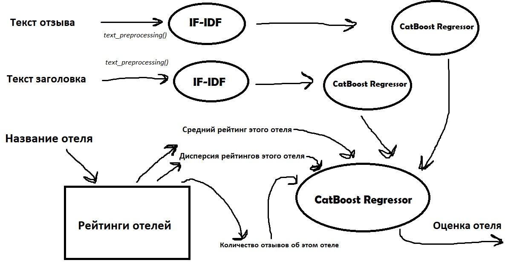

# NLP
Предсказание рейтинга отеля по отзыву
<code>[**Тетрадка с обучением**](https://github.com/quaterhalfbro/NLP/blob/main/text_analys.ipynb)</code>
<code>[**Тренировочные данные**](https://github.com/quaterhalfbro/NLP/blob/main/train.csv)</code>
<code>[**Тестовые данные**](https://github.com/quaterhalfbro/NLP/blob/main/test.csv)</code>
<code>[**Вспомогательные данные: список позитивных слов**](https://github.com/quaterhalfbro/NLP/blob/main/positive-words.txt)</code>
<code>[**Вспомогательные данные: список негативных слов**](https://github.com/quaterhalfbro/NLP/blob/main/negative-words.txt)</code>

# Модель:

